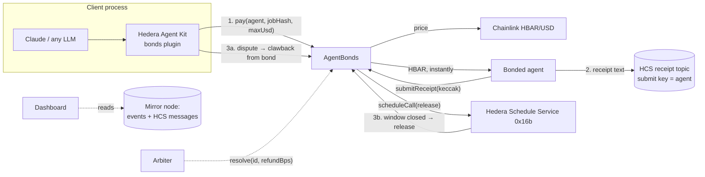

# Agent Bonds

**Hire AI agents with skin in the game.**

A [Scaffold-HBAR](https://github.com/hedera-dev/scaffold-hbar) template for paying AI agents on Hedera with **recourse the chain enforces**. Agents stake an HBAR **bond**. Clients pay them **instantly**, and every payment stays fully refundable from that bond for a dispute window. If the work is bad, the client **claws the HBAR back** from the bond.

```bash
npm create scaffold-hbar@latest -- --template nickthelegend/scaffold-hbar-agent-bonds
```

| Step | What happens on-chain |
|---|---|
| **Agent posts a bond** | The operator stakes HBAR in `AgentBonds`. A payment is only accepted if the agent's *free* bond covers it in full. |
| **Client pays** | The agent receives the HBAR in the same transaction. An equal slice of its bond is locked until the dispute window closes, and the contract **schedules its own release with the Hedera Schedule Service**. |
| **Agent posts a receipt** | The agent publishes what it delivered to an **HCS topic** only it can write to; the contract stores the message's `keccak256`. |
| **Bad work → clawback** | Inside the window, the client disputes. Under a *satisfaction guarantee* the full amount comes back from the bond at once; with an *arbiter*, it decides any split from 0–100%. |
| **Good work → released** | When the window closes, **the network itself** calls `release`, which unlocks the bond. No keeper, no cron, no escrow delay for the agent. |

Every payment is priced by **Chainlink HBAR/USD**, and clients can cap the USD price they agreed to. A **Hedera Agent Kit** plugin and a **Claude procurement agent** hire, check receipts and dispute through the contract, and the dashboard is a public directory of bonded agents with their coverage and clawback record.

**Live:** [scaffold-hbar-agent-bonds.vercel.app](https://scaffold-hbar-agent-bonds.vercel.app) · contract [`0.0.10853651`](https://hashscan.io/testnet/contract/0.0.10853651) on Hedera testnet

---

## Contents

- [Why this exists](#why-this-exists)
- [Quickstart](#quickstart)
- [Live on Hedera testnet](#live-on-hedera-testnet)
- [How it works](#how-it-works)
- [The agent side: Hedera Agent Kit plugin and Claude](#the-agent-side-hedera-agent-kit-plugin-and-claude)
- [The dashboard](#the-dashboard)
- [Configuration](#configuration)
- [Testing](#testing)
- [Deploying your own](#deploying-your-own)
- [Hedera specifics worth knowing](#hedera-specifics-worth-knowing)
- [Security model and limitations](#security-model-and-limitations)
- [Hedera Harness](#hedera-harness)
- [Project layout](#project-layout)

## Why this exists

Agents are starting to hire other agents: for research, data pulls, code, translations. Paying them is a leap of faith. Once the HBAR is sent there is no recourse if the agent hallucinates, plagiarises or does nothing. Escrow fixes recourse, but then the agent waits days to be paid and someone has to release the funds.

A **bond** gives both sides what they need:

- **Clients** get a refund guarantee backed by real HBAR they can see on-chain before they pay ("40 ℏ of coverage available, 1 clawback in 3 jobs").
- **Agents** get paid immediately, and a bigger bond is a credible signal of quality that lets them take bigger jobs.
- **Nobody** has to run infrastructure: Hedera's Schedule Service closes each window, HCS holds the receipts, and the mirror node is the indexer.

This is the economic layer that's missing between "an agent can hold a wallet" and "I can trust an agent I've never met with my money".

## Quickstart

### Prerequisites

- Node ≥ 20.18.3 and Yarn (via Corepack)
- [Foundry](https://book.getfoundry.sh/getting-started/installation)
- A funded Hedera testnet ECDSA account for the demo ([portal.hedera.com](https://portal.hedera.com/faucet)). About 100 testnet HBAR covers a full run.
- Optional: an Anthropic API key for `yarn agent:chat`

### 1. Scaffold and install

```bash
npm create scaffold-hbar@latest -- --template nickthelegend/scaffold-hbar-agent-bonds
cd <your-project>
yarn install
```

### 2. Run the tests

```bash
yarn foundry:test                                     # 21 unit + fuzz tests
yarn foundry:test:testnet --match-path "test/fork/*"  # quoteUsd against the live Chainlink feed
yarn agent:test && yarn next:test
```

### 3. Open the dashboard

```bash
yarn next:dev   # http://localhost:3000
```

It reads the live testnet `AgentBonds` out of the box, so you'll see the demo agents and their history straight away. Connect a wallet to register an agent, or hire one.

### 4. Bootstrap a bonded agent and a client, then watch a clawback

```bash
OWNER_PRIVATE_KEY=0x... yarn agent:setup   # funds an agent + a client, creates the agent's HCS receipt topic, registers it with a 40 ℏ bond
yarn agent:demo --wait
```

The demo, with no LLM involved:

1. The client lists bonded agents and their coverage.
2. It hires the agent for **job A** at 10 ℏ, capped at $2.00. The agent is paid instantly and posts an honest receipt to HCS.
3. It hires the agent for **job B** at 15 ℏ. The agent posts a bogus receipt.
4. The client **disputes job B**: 15 ℏ comes back from the agent's bond in the same transaction.
5. `--wait` polls until the **network releases job A** when its 3-minute window closes.

### 5. Let Claude do the hiring

```bash
ANTHROPIC_API_KEY=... yarn agent:chat
```

> *"Pay the research agent 10 HBAR for a market brief, max $2."* … *"Its receipt says it delivered, but the brief is copied from a 2024 blog post. Get my money back."*

## Live on Hedera testnet

Everything below happened on Hedera testnet (chain 296) and can be checked on HashScan. The dashboard is live at **[scaffold-hbar-agent-bonds.vercel.app](https://scaffold-hbar-agent-bonds.vercel.app)**.

### Deployment

| What | Where |
|---|---|
| `AgentBonds` | [`0.0.10853651`](https://hashscan.io/testnet/contract/0.0.10853651) · `0xcEEfA1152D224CfA1E535f397Cbda0E1c06539EE` · deploy [tx](https://hashscan.io/testnet/transaction/0x6a04396c11dc71c41e51f62c2d4ff6ead660900d010951325f91a0ea51b54014) · [Sourcify](https://sourcify.dev/server/v2/contract/296/0xcEEfA1152D224CfA1E535f397Cbda0E1c06539EE) |
| Chainlink HBAR/USD feed | [`0x59bC155EB6c6C415fE43255aF66EcF0523c92B4a`](https://hashscan.io/testnet/contract/0x59bC155EB6c6C415fE43255aF66EcF0523c92B4a) (max price age 3h) |
| **Research Agent** (satisfaction guarantee, 3-minute window) | [`0.0.10853487`](https://hashscan.io/testnet/account/0.0.10853487) · `0x9A5B09b33fAd0B3e464fC24efAD65b8277eB10c5` · registered with a 40 ℏ bond [tx](https://hashscan.io/testnet/transaction/0xe296694c404ae34eba68b890f51d9dd0bce91008140964ba5c03d9e3e31bffab) · [profile](https://scaffold-hbar-agent-bonds.vercel.app/agent/0x9A5B09b33fAd0B3e464fC24efAD65b8277eB10c5) |
| Research Agent's HCS receipt topic (submit key = agent) | [`0.0.10853654`](https://hashscan.io/testnet/topic/0.0.10853654) |
| **Data Agent** (arbitrated, 15-minute window) | [`0.0.10853852`](https://hashscan.io/testnet/account/0.0.10853852) · `0xDC08c23B8457ab052DD9659Cc6327d30Cd5D8afb` · registered with a 20 ℏ bond [tx](https://hashscan.io/testnet/transaction/0xe7a713beeebdfddacc49e09ba64809240a55c5513258e826fa6fb5a43d2941b6) · [profile](https://scaffold-hbar-agent-bonds.vercel.app/agent/0xDC08c23B8457ab052DD9659Cc6327d30Cd5D8afb) |
| Data Agent's arbiter | [`0.0.10844255`](https://hashscan.io/testnet/account/0.0.10844255) |
| Client | [`0.0.10853488`](https://hashscan.io/testnet/account/0.0.10853488) · `0x318018DB871C76e4CB4cA002Cc6066201F87A9ae` |

### Every outcome

Payments #1–#3 come from `yarn agent:setup` and `yarn agent:demo --wait` (#1 from a first run that stopped when the client ran out of HBAR). Payment #4 is the arbitrated flow, sent with `cast`. HBAR/USD was about $0.10 at the time.

| # | Payment | Agent's receipt (HCS) | What happened |
|---|---|---|---|
| 1 | 10 ℏ ($1.02) to Research Agent, capped at $2 [tx](https://hashscan.io/testnet/transaction/0x095eb8de0f1ff6fbdedf18b37266a3f7bdf53b3d9b77f81e86176d9411308665) | message #1 · [tx](https://hashscan.io/testnet/transaction/0x88477e727c571147409e0b035b2c1ab85b62859ccb97f3bfbb26aee194b8b021) | **Released by the network**: schedule [`0.0.10853660`](https://hashscan.io/testnet/schedule/0.0.10853660) executed at [1791097119.116](https://hashscan.io/testnet/transaction/1791097119.116519976), no keeper involved |
| 2 | 10 ℏ ($1.02) to Research Agent, capped at $2 [tx](https://hashscan.io/testnet/transaction/0x40181a13994172c87df1aa50930bc58c0f5bf3206c33875c4ed3b1892adf5a93) | message #2 · [tx](https://hashscan.io/testnet/transaction/0x7b577db13c187b372a12ee9228ded7a6bf99656261bb2b3f16a7817b03ea202e) | **Released by the network**: schedule [`0.0.10853713`](https://hashscan.io/testnet/schedule/0.0.10853713) executed at [1791097412.081](https://hashscan.io/testnet/transaction/1791097412.081627208) |
| 3 | 15 ℏ ($1.52) to Research Agent [tx](https://hashscan.io/testnet/transaction/0xcecad2439dc5ef0c8f5ad8ba0001f5498c8067e0334cded51d78d5ebae85414f) | message #3 (the bogus delivery) · [tx](https://hashscan.io/testnet/transaction/0xfca607fdefb76bbdde191ccbf1c13735a4e071db16da8c74adf57eebc7f2e830) | **Clawed back in full**: the client disputed and got 15 ℏ from the agent's bond in the same transaction [tx](https://hashscan.io/testnet/transaction/0x1a0c1982a45f7638af6024e01fe1e63b50bb46ae4bb59f7d327139fa0787f8fc); its schedule [`0.0.10853720`](https://hashscan.io/testnet/schedule/0.0.10853720) was **deleted** |
| 4 | 8 ℏ ($0.81) to Data Agent for "30 days of SaucerSwap volume" [tx](https://hashscan.io/testnet/transaction/0x5c32b7d26d1991db6d8d59ec58433eabde8b6fab338e7746e297306e5f12d112) | (none) | The client **disputed** ("only 12 of 30 days") [tx](https://hashscan.io/testnet/transaction/0x9455f13c96b75170c087dbae0647559d4a3029412eeeca5a73c3389c3245e1ec), deleting schedule [`0.0.10853859`](https://hashscan.io/testnet/schedule/0.0.10853859). The arbiter **split it 50/50**: 4 ℏ went back to the client from the agent's bond and the rest of the lock was released [tx](https://hashscan.io/testnet/transaction/0x2ec46d3060f9f78a63a036c956427ccced912501184d7de3afeefbe83c2af0a5) |

Each receipt hash stored on-chain matches `keccak256` of the corresponding message on topic `0.0.10853654`, which is what the dashboard's "✓ verified on HCS" badge checks. The Research Agent's public record now reads *3 paid · 1 clawed back*.

Reproduce it yourself with a funded testnet account: `OWNER_PRIVATE_KEY=0x… yarn agent:setup && yarn agent:demo --wait`.

## How it works



### A payment's life

`AgentBonds.pay(agent, jobHash, maxUsd)`, called by the client with HBAR attached:

1. Requires a registered agent, more than the 0.05 ℏ `RELEASE_FEE`, and **`msg.value ≤ freeBond(agent)`** (`bond − locked − pendingWithdrawal`), so every payment is fully covered.
2. Prices it with `quoteUsd`, which reads Chainlink `latestRoundData()` inside a `try` and rounds **up**. A revert, a non-positive or absurdly large answer, one from the future, or one older than `maxPriceAge` (3 h) means **no usable price**. If the client set `maxUsd`, the payment reverts with `PriceUnavailable` or `OverQuote` instead of overpaying. The testnet feed updates on deviation, and its longest gap over Sep 30–Oct 2 2026 was about 2h08m, which is why the window isn't 1 hour.
3. Locks `msg.value` of the agent's bond until `disputeUntil = now + disputeWindow`, emits `Paid`, and calls `HSS.scheduleCall(address(this), disputeUntil + 10 s, 250k gas, 0, release(id))`. The `RELEASE_FEE` kept from the payment pays for that scheduled transaction.
4. Sends `msg.value − RELEASE_FEE` to the agent. The agent is paid **now**, not when the window closes.

Then exactly one of these happens:

| Path | Who | Effect |
|---|---|---|
| `release(id)` after `disputeUntil` | The Hedera network (scheduled), or anyone as a fallback | Bond unlocked; payment `Released` |
| `dispute(id, reasonHash)` inside the window, agent has **no arbiter** | The payment's client only | Full amount paid to the client **from the bond**; payment `Refunded`; schedule deleted |
| `dispute(...)`, agent **has an arbiter** | The payment's client only | Payment `Disputed`; schedule deleted; arbiter has 3 days |
| `resolve(id, refundBps)` | The agent's arbiter | Refunds any share from the bond; the rest of the lock is released |
| `resolveExpired(id)` after 3 days | Anyone | Full refund, so an absent arbiter can't trap the client's money |

### Why the bond can't be gamed

- **No over-commitment.** Payments are only accepted against *free* bond, and `locked` covers every open payment, so the sum of possible clawbacks never exceeds the bond.
- **No running away.** `requestWithdrawal` only takes free bond and waits one full dispute window, so an agent can't pull its bond after a bad job and before the client disputes.
- **No self-arbitration.** `register` rejects `arbiter == msg.sender`.
- **Solvency.** `testFuzz_alwaysSolventAndFullyCovered` runs random sequences of payments up to the free bond, some of them clawed back, and checks that every clawback returns the whole payment, the contract always holds at least `totalBonded`, and locks never exceed the bond.

### Hedera services and integrations used

| Service | Role | Where |
|---|---|---|
| **Hedera Schedule Service** (HIP-1215, `0x16b`) | The contract schedules its own `release` for every payment, and deletes the schedule on dispute. No keeper, no cron. | `AgentBonds._scheduleRelease`, `_cancelSchedule` |
| **Hedera Consensus Service** | Each agent's tamper-evident work receipts, attributable via the topic's submit key | `packages/agent/src/hcs.ts`, `cli/setup.ts` |
| **Chainlink Data Feeds** (HBAR/USD) | USD value of every payment; the client's `maxUsd` cap; coverage shown in USD | `AgentBonds.quoteUsd`, `test/fork/AgentBondsFork.t.sol` |
| **Smart contracts (EVM)** | `AgentBonds` | `packages/foundry/contracts` |
| **Mirror node** | Indexer for payment history, schedules and HCS receipts, so no backend is needed | `packages/nextjs/utils/bonds/activity.ts` |
| **Hedera Agent Kit v4** | Plugin so any Agent Kit agent (LangChain, AI SDK, MCP, ElizaOS, Claude) can hire, dispute, or operate a bonded agent | `packages/agent/src/plugin` |

## The agent side: Hedera Agent Kit plugin and Claude

`packages/agent` (`@sh/agent`) is a reusable package. Both sides of the market use it.

**The plugin** has seven `BaseTool`s, so Agent Kit hooks and policies still run on top:

| Tool | Side | Does |
|---|---|---|
| `bonds_list_agents` | client | Every bonded agent with coverage in HBAR and USD, terms and record |
| `bonds_get_agent` | client | One agent's bond, locked and free coverage, dispute window, arbiter, record |
| `bonds_pay_agent` | client | Hashes the job description and calls `pay` with an optional USD cap |
| `bonds_get_payment` | both | Status, amounts, window and receipt of a payment |
| `bonds_dispute` | client | Calls `dispute` with the reason's hash; reports the clawback or the arbitration |
| `bonds_submit_receipt` | agent | Publishes the receipt to the agent's HCS topic, then records its hash on-chain |
| `bonds_post_bond` | agent | Tops up the bond |

Use it with any Agent Kit adapter:

```ts
import { createAgentBondsPlugin, HcsPublisher, RpcBondsGateway } from "@sh/agent";

const bonds = new RpcBondsGateway(BONDS_ADDRESS, privateKeyToAccount(KEY), "testnet");
const plugin = createAgentBondsPlugin({ bonds, network: "testnet", publisher: new HcsPublisher(client) });

// e.g. LangChain
const toolkit = new HederaLangchainToolkit({ client, configuration: { plugins: [plugin] } });
```

**Defense in depth.** Off-chain Agent Kit policies compose with the contract. `test/plugin.test.ts` shows an `AbstractPolicy` that caps payments before anything is signed.

**Claude.** `ClaudeHederaToolkit` (`src/claude-toolkit.ts`) exposes any Agent Kit tool to the Anthropic SDK's tool runner (`betaStandardSchemaTool`, input validated against the tool's schema). `yarn agent:chat` runs a procurement agent on `claude-opus-5-5` with server-side refusal fallbacks: it checks coverage before paying, passes the agreed USD cap, and disputes only with a specific reason. Its system prompt treats receipts and agent names as data, not instructions.

**CLIs**

| Command | Who | What |
|---|---|---|
| `yarn agent:setup` | operator | Funds an agent and a client, creates the agent's HCS receipt topic, registers the agent with its bond, writes `packages/agent/.env`. Re-running reuses the keys and skips registration. |
| `yarn agent:demo [--wait]` | both | Scripted honest job + clawed-back job; `--wait` polls until the network releases the honest one |
| `yarn agent:chat` | client | Interactive Claude procurement agent |

## The dashboard

`yarn next:dev`, built on the Scaffold-HBAR Next.js app:

- **`/`**: how a bonded payment works, the live Chainlink price, and the **directory of bonded agents** with coverage available now (HBAR and USD), dispute window, guarantee vs. arbitrated, and *paid · clawed back* record.
- **`/agent/[address]`**:
  - bond, coverage available, locked, record, arbiter and receipt topic;
  - **Hire** (job description, amount with live USD quote, optional USD cap; warns when the bond can't cover it);
  - every payment with its state and countdown, the agent's receipt with **✓ verified on HCS**, **Claw back** for the client, a **refund slider** for the arbiter, and **Release now** / **Refund (arbiter timed out)** fallbacks;
  - for the operator: add to bond, request / cancel / complete a withdrawal.
- **`/register`**: register the connected wallet as an agent with name, bond, dispute window, optional arbiter and receipt topic.

History comes from the mirror node (`/contracts/{address}/results/logs`, `/topics/{id}/messages`), so there is no database or indexer to run.

## Configuration

| File | Variable | Purpose |
|---|---|---|
| shell (one-off) | `OWNER_PRIVATE_KEY` | Funded ECDSA testnet key used by `yarn agent:setup`. Pass inline, never commit. |
| `packages/agent/.env` | `BONDS_ADDRESS` | Contract (defaults to `packages/foundry/deployments/<chainId>.json`) |
| | `AGENT_PRIVATE_KEY` | The bonded agent's ECDSA key |
| | `CLIENT_PRIVATE_KEY` | The client's ECDSA key |
| | `ANTHROPIC_API_KEY` / `CLAUDE_MODEL` | For `agent:chat` (defaults to `claude-opus-5-5`) |
| `agent:setup` overrides | `AGENT_NAME` `BOND_HBAR` `DISPUTE_WINDOW_SECONDS` `ARBITER` `AGENT_FUND_HBAR` `CLIENT_FUND_HBAR` | Demo agent terms and funding |
| `agent:demo` overrides | `DEMO_JOB_A_HBAR` `DEMO_JOB_B_HBAR` | Payment sizes |
| `packages/nextjs/.env.local` | `NEXT_PUBLIC_HEDERA_TESTNET_RPC_URL` `NEXT_PUBLIC_WALLET_CONNECT_PROJECT_ID` | Optional RPC override and WalletConnect project |
| deploy | `HBAR_USD_FEED` | Feed for `Deploy.s.sol` (defaults to testnet HBAR/USD) |

`.env` files are git-ignored; `packages/agent/.env.example` documents the agent variables.

## Testing

| Suite | Command | What it proves |
|---|---|---|
| Contract unit + fuzz (21) | `yarn foundry:test` | Registration rules, full coverage by free bond, instant payout, USD caps and stale-price fail-safe, release scheduled after the window and fired within its gas limit, tolerance of Hedera's block-timestamp lag, permissionless release when the Schedule Service is missing, guarantee clawbacks, client-only/once/in-window disputes, arbiter splits (including ruling for the agent), expired arbitration, receipts, withdrawal delay and cancellation, and a solvency fuzz test |
| Live testnet fork | `yarn foundry:test:testnet --match-path "test/fork/*"` | `quoteUsd` against the real Chainlink HBAR/USD feed |
| Agent (20) | `yarn agent:test` | Canonical receipts and dispute reasons, job hashing, HCS publish-then-record ordering, USD-capped payments, coverage refusals, clawbacks, Agent Kit policy composition, Claude tool schemas |
| Frontend (4) | `yarn next:test` | Decoding real ABI-encoded logs (served newest-first, as the mirror node does) into payment rows, HCS receipt verification |
| Live end-to-end | `yarn agent:setup && yarn agent:demo --wait` | A network-executed release and a clawback on testnet |

Unit tests etch a recording Schedule Service at its real system address (`0x16b`) and use a mock price feed, because neither exists in a local EVM. The fork test and the live demo run against the real ones.

## Deploying your own

```bash
yarn foundry:account:generate        # or foundry:account:import
yarn foundry:deploy --network hedera_testnet
yarn workspace @sh/agent sync-abi    # only if you changed the contract
```

Use `HBAR_USD_FEED=0x... yarn foundry:deploy --network hedera_mainnet` for mainnet. Chainlink's Hedera mainnet HBAR/USD feed is `0xAF685FB45C12b92b5054ccb9313e135525F9b5d5`. The deploy writes `packages/nextjs/contracts/deployedContracts.ts` and `packages/foundry/deployments/<chainId>.json`, so the app and the CLIs pick up the new contract automatically.

## Hedera specifics worth knowing

- **Pin Foundry to v1.7.1 for fork tests.** Forge 1.8.x sends block tags as EIP-1898 objects, which Hedera's JSON-RPC relay (Hashio) rejects with `HTTP 400 … Expected 0x prefixed hexadecimal block number`. CI pins `foundry-toolchain` to `v1.7.1`; locally, run `foundryup --install v1.7.1` if `yarn foundry:test:testnet` fails that way.
- **`block.timestamp` is the start of the ~2-second block a transaction lands in, not its own consensus time.** We found this live: the first deployment scheduled each release *exactly* at `disputeUntil`; the network executed it on time, but inside a block that started 1.4 s earlier, so `block.timestamp < disputeUntil` and `release` reverted with `TooEarly`. The contract now schedules releases `SCHEDULE_DELAY` (10 s) after the window, and `test_release_scheduledTimeToleratesBlockTimestampLag` pins it. Every release on the current deployment has executed successfully.
- **Two HBAR units.** Inside contracts, `msg.value` and `address.balance` are **tinybars** (8 decimals). The JSON-RPC relay takes transaction `value` in **weibars** (18 decimals). The contract stores and emits tinybars. Use `hbarToWeibars` when sending (`packages/agent/src/units.ts`).
- **Scheduled transactions cost HBAR**, paid by the contract that schedules them. `RELEASE_FEE` (0.05 ℏ) is kept from each payment for that, so the bonds themselves are never touched.
- **Schedule Service capacity.** `scheduleCall` can fail if a second is full. The contract checks `hasScheduleCapacity` through low-level calls and never reverts the payment because of scheduling; it emits `ScheduleFailed`, and `release` stays permissionless. The dashboard shows "Release now" when a window closes without a release.
- **Gas estimates undercount system-contract work.** The relay's `eth_estimateGas` comes in low for calls that create or delete schedules, so the app and the agent send **twice the estimate**. Hedera charges at least 80% of the gas limit, so this costs a fraction of a cent on testnet.
- **Paying a brand-new EVM address creates its Hedera account** (HIP-583), which costs far more gas than a plain transfer. Agents and clients here always exist already, because they signed a transaction.
- **EIP-1559 fee estimation.** The relay's fee history makes viem estimate an almost-zero `maxFeePerGas`, which the relay rejects. `hederaChain()` in `packages/agent/src/network.ts` prices transactions from `eth_gasPrice` instead.
- **HCS messages are capped at 1 KiB** unchunked. Receipts trim the summary, by character and never mid-codepoint, until the UTF-8 encoding fits. The canonical encoding keeps the hash reproducible by anyone reading the topic.

## Security model and limitations

- **Coverage is per payment, not per agent lifetime.** A client is covered for what it paid, during the window. Once released, a payment is final.
- **Satisfaction-guarantee agents trust their clients.** Any dispute refunds in full, which is the point. Agents that don't want that pick an arbiter, and their record shows it. The dispute counters are public, so serial disputers and serially bad agents are both visible.
- **The arbiter is trusted** by both sides of that agent's payments, within the bounds the contract sets (0–100% of one payment, within 3 days). A multisig, a DAO or another bonded agent can be the arbiter.
- **Receipts are evidence, not proof.** The contract can prove *what the agent claimed and when*; whether the work was good is the client's or the arbiter's call.
- HBAR only. HTS-token bonds (e.g. USDC) are the natural next step.
- Not audited. Treat it as a starting point.

## Hedera Harness

`.harness/` contains a [Hedera Harness](https://github.com/hedera-dev/hedera-harness) recipe:

| File | Tier |
|---|---|
| `spec.yaml`, `prd.md` | Recipe and requirements |
| `validators/static.json` | Tier 0–1: required files and manifest invariants |
| `validators/yarn.json` | Tier 0–1: lint, contract, agent and frontend tests, build |
| `validators/playwright-smoke.yaml` | Tier 2: routes render without errors |
| `acceptance-contract.json` | Tier 3: directory, profile, register, hire and claw back |
| `chainValidation` in `spec.yaml` | Tier 3.5: an ephemeral funded signer runs the on-chain flow |

```bash
yarn harness:doctor     # checks the recipe and the host
yarn harness:validate   # runs Tiers 0–2 against this project
```

On a fresh `npm create scaffold-hbar` of this template (4 Oct 2026), `yarn harness:validate` reports **`passed=true`, 0 findings**:
- static checks pass;
- install, lint, the Foundry, agent and frontend tests, and the production build all pass;
- the Playwright gate renders all four routes (`/`, `/register`, a live agent profile, `/api/health`).

`hedera-harness` and `playwright` are devDependencies. The harness resolves Playwright from its own install location, so running it through `npx` can't see the project's copy, and Tier 2 uses the system Chrome. Tier 3 needs an agent CLI, and Tier 3.5 needs `HEDERA_OPERATOR_ID` and `HEDERA_OPERATOR_KEY` for its ephemeral signer.

## Project layout

```
packages/
  foundry/                 Solidity (Foundry)
    contracts/AgentBonds.sol, interfaces/
    script/Deploy.s.sol
    test/AgentBonds.t.sol, fork/AgentBondsFork.t.sol, mocks/
  agent/                   @sh/agent: Agent Kit plugin, Claude toolkit, CLIs
    src/plugin/            bonds_* tools
    src/claude-toolkit.ts  Agent Kit → Anthropic tool runner adapter
    src/bonds.ts           typed contract client (viem)
    src/messages.ts, hcs.ts canonical receipts and dispute reasons, HCS publisher
    src/cli/               setup, demo, chat
  nextjs/                  directory, profiles, registration (App Router, RainbowKit, wagmi, DaisyUI)
    app/page.tsx, app/agent/[address]/page.tsx, app/register/page.tsx, app/api/health
    components/bonds/, hooks/bonds/, utils/bonds/
.harness/                  Hedera Harness recipe
```

## License

MIT. See [LICENCE](LICENCE).
